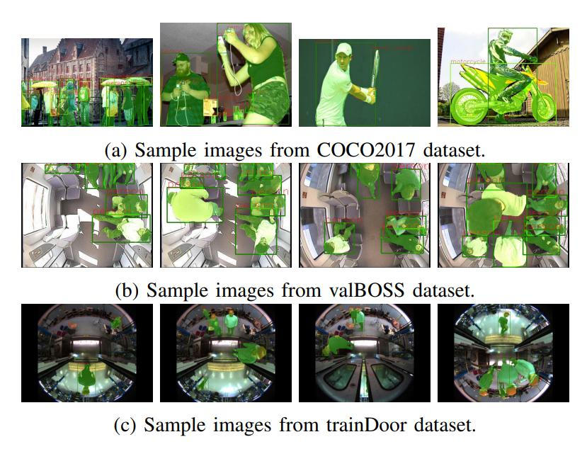

StixelNet: A Deep Convolutional Network for Obstacle Detection and Road Segmentation    
http://www.cvlibs.net/projects/autonomous_vision_survey/literature/Levi2015BMVC.pdf    

Fast Drivable Area Detection for Autonomous Driving with Deep Learning    

Real-Time Semantic Segmentation for Fisheye Urban Driving Images Based on ERFNet    
https://www.ncbi.nlm.nih.gov/pmc/articles/PMC6387192/    

Instance segmentation in fisheye images    
https://hal.archives-ouvertes.fr/hal-02963004/document    

Semantic Segmentation of Fisheye Images    
https://openaccess.thecvf.com/content_ECCVW_2018/papers/11129/Blott_Semantic_Segmentation_of_Fisheye_Images_ECCVW_2018_paper.pdf    

Universal Semantic Segmentation for Fisheye Urban Driving Images    
https://arxiv.org/pdf/2002.03736.pdf    

https://github.com/Qualcomm-AI-research/InverseForm    

EfficientPS Demo    
http://panoptic.cs.uni-freiburg.de/ 

MMSegmentation    
https://github.com/open-mmlab/mmsegmentation    